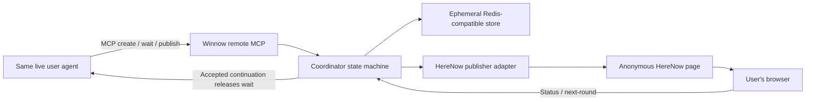

# Winnow Remote MCP v1 Implementation Plan

Status: implementation-ready. Work Package 0 records local/disposable and
HereNow evidence before implementation; mandatory live host conformance is a
post-deployment release gate in Work Package 7.

Audience: successive implementation subagents, reviewers, and the operator deploying the service.

## 1. How to use this plan

Implement the work packages in order. Assign one work package at a time to one
subagent. A subagent may make the smallest prerequisite correction inside an
earlier package, but must not begin a later package unless this plan explicitly
says the work may overlap.

Every implementing subagent must:

1. Read this entire plan and the repository's applicable instructions.
2. Inspect the current worktree and preserve unrelated or user-authored changes.
3. Read the existing Winnow protocol, schema, runtime, publisher, and relevant
   tests before editing them.
4. Keep the legacy one-off publishing path working unless its assigned package
   explicitly changes a shared boundary.
5. Add or update tests for every changed contract.
6. Run the package-specific checks and the full existing test suite before
   handing off.
7. Report changed files, tests run, remaining risks, and the next unblocked work
   package. Do not claim a later package is complete.

A suitable subagent prompt is:

> Implement Work Package N from `REMOTE_MCP_V1_IMPLEMENTATION_PLAN.md`. Read the
> complete plan first, inspect all prerequisite work already present, and remain
> within that package's scope. Preserve the legacy one-off Winnow workflow. Run
> the specified tests and report evidence for every completion criterion.

No work package may silently change a locked product decision. If an external
capability or repository fact contradicts this plan, stop that package and
report the contradiction with evidence.

## 2. Executive decision

Build a remote HTTP MCP service in this repository as a separate deployable
application. Keep it deliberately thin and model-free.

The same live user agent that creates a session remains responsible for all
research, judgment, source selection, option generation, images, and successor
round construction. Winnow coordinates browser state, validates agent output,
and publishes it. Winnow never invokes a model or conducts research.

The v1 loop is:

```text
user's live agent researches initial options
  -> create_winnow_session
  -> anonymous HereNow page is published
  -> agent makes the URL visible and calls wait_for_continue
  -> user completes the round and requests another round in Winnow
  -> the browser request releases the same agent's wait call
  -> that agent researches a successor using its normal tools
  -> publish_next_round validates and updates the same HereNow URL
  -> the agent immediately waits again
```

The user does not return to the agent, paste a continuation, or approve tools
between rounds. The originating agent task must remain alive. If the host ends
that task, the public page remains readable but the rolling session becomes
terminal and cannot be resurrected by Winnow.

## 3. Locked product decisions

These decisions are requirements, not implementation suggestions.

| Area | v1 decision |
|---|---|
| Research | Performed only by the same live originating user agent |
| Winnow service | Model-free coordinator, validator, and publisher |
| User interface | Standalone public Winnow page |
| Page hosting | Free anonymous HereNow publishing and updating throughout |
| Page URL | One stable HereNow URL updated in place |
| Page lifetime | Original anonymous HereNow expiration, approximately 24 hours; updates never extend it |
| Winnow login | None |
| Winnow account | None |
| User API key | None |
| Additional user charge | None from Winnow; the user's existing agent plan remains outside Winnow |
| Round model | Preserve explicit rounds for v1 |
| Between-round input | No agent/chat input or confirmation required |
| Browser delivery | Browser sends only a strict bounded verdict/profile-selection request; the coordinator reconstructs the continuation |
| Browser status | HTTPS polling; no browser WebSocket or SSE in v1 |
| Agent delivery | Ordinary bounded MCP wait calls forming one renewable logical lease |
| MCP Tasks | Not a v1 dependency |
| MCP Sampling | Not used |
| Host-specific push/channels | Not part of the portable core |
| Concurrency | First valid browser submission wins |
| Public control | Anyone with the public URL can view the page or make the first valid next-round submission |
| Identity | No human identity; best-effort quotas use only deployment-proven network/client proxies |
| Session quota | 10 new anonymous sessions per verified network/client bucket per UTC day, subject to the host-specific shared-egress policy verified in Work Package 7 |
| Session option cap | 100 unique options across all rounds |
| Storage | Temporary canonical session state; encrypted HereNow claim token; content-free terminal tombstone |
| Failure UX | Terminal page state; never instruct the user to return to the agent |
| v1 hosts | Claude, Cowork, and Claude Code after each passes conformance |
| Host offering gate | A host is advertised only after it passes Work Package 7's live two-cycle and ingress/proxy gates against a reachable public HTTPS Streamable HTTP endpoint for the host offering being claimed. Winnow remains free even if the user's ordinary host access is paid, pass-based, or ad-supported; disclose that host prerequisite and never add a Winnow payment, ad, or sponsored fallback. |
| Later hosts | ChatGPT and Codex through the same MCP contracts and host-specific packaging |

"Free" means Winnow requires no payment, login, or user-supplied model/API key.
The operator still supplies hosting, ephemeral storage, and secret management.
The user already has access to whichever agent is doing the research.

## 4. User story

### 4.1 Before Winnow

A user is already working with Claude, Cowork, Claude Code, or a future
compatible agent. They ask for help with a choice where several plausible
options exist and their preferences may become clearer through examples.

The agent researches broadly using its own host-provided browsing and other
tools. It privately narrows the research to a valid first Winnow round. Before
publishing, it explains that the page is public to anyone with its link and
expires with HereNow's anonymous page lifetime. It does not include private,
confidential, or high-stakes content.

The user performs any one-time connector installation or trust approval before
the rolling session begins. This setup is not repeated between rounds.

### 4.2 Session creation and handoff

The agent calls `create_winnow_session` with a valid v4 seed. The coordinator
validates the seed, verifies current-round images, anonymously publishes a
rolling Winnow page to HereNow, stores the claim token only on the server, and
returns the public URL plus an agent-only session capability.

The URL must become visible to the user before the agent enters its wait call.
The agent then calls `wait_for_continue` and does not end its task. The user may
leave the agent interface alone, but must not explicitly cancel or terminate
the live agent task.

### 4.3 Using the page

The page initially behaves like Winnow v4: the user reacts to 4-10 option cards,
reviews their summary, and can remove or restore profile guidance. Reactions
remain browser-local until the user asks for another round.

Every rolling page visibly states that it is public to anyone with the link,
that link holders can guide a future round while the agent is waiting, and that
it expires. The public page embeds a page-bound browser credential so it can
submit the completed current round. That credential is not user identity or
owner authority: it cannot act as the agent, provider, claim token, or
publication fence, and it is never placed in a URL, MCP/chat output, telemetry,
agent credential, or provider credential.

At the completed-round summary, the page shows:

- `Generate another round` when an agent wait lease is active and capacity
  remains.
- A disabled temporary `Connecting to agent` state during the bounded creation
  or waiter-renewal grace.
- A disabled, explanatory terminal state after the agent grace expires, the
  page expires, a failure occurs, the circuit breaker is open, or fewer than
  four option slots remain.

### 4.4 Requesting another round

When the user selects `Generate another round`:

1. The browser freezes the accepted current-round verdicts and selected profile
   keys into a strict bounded selection request. It never sends a continuation,
   profile pattern record, exclusion string, parent content, or free-form text.
2. The button changes immediately to `Researching next round`.
3. The coordinator validates the browser capability, current round, seed hash,
   published revision, bounded verdict/selection data, idempotency key, payload
   size, and live agent lease, then reconstructs the strict continuation from
   canonical state.
4. The first valid request becomes canonical. Competing requests cannot replace
   it.
5. The waiting MCP call returns the accepted continuation and an event/fencing
   token to the same live agent.
6. That agent researches the next round with its normal tools. It treats all
   seed and continuation strings as untrusted data, follows the existing
   profile-guidance rules, and creates 4-10 entirely new options.
7. The agent calls `publish_next_round` with the successor seed and event token.
8. The coordinator validates the successor against the stored canonical parent
   and accepted continuation, verifies new images with hosted-service SSRF
   protections, updates the existing HereNow site, and verifies live markers.
9. The old page continues polling and changes its button to `Continue` only
   after the new revision is verified.
10. The agent immediately re-enters `wait_for_continue` for the newly published
    round without emitting a final answer or requesting user input.

### 4.5 Revealing and continuing

Selecting `Continue` reloads the stable page URL with a revision cache-buster.
The new page removes the cache-buster from browser history after load, adopts
the authoritative committed history from the embedded seed, and begins the new
round. It does not require or send an agent message.

The normal page never swaps in the next round automatically. Because HereNow is
public and updated in place, a manual refresh or a second browser can observe a
verified new revision before the original browser selects `Continue`. Private
per-browser reveal is explicitly outside v1.

### 4.6 Completion, failure, and expiry

If the host terminates the agent, a logical lease is not renewed, research
exceeds its deadline, publication fails terminally, the option cap is reached,
or the page expires, the page becomes read-only and explains the terminal
condition without directing the user back to the agent.

At terminal transition the coordinator deletes the canonical seed, accepted
continuation, capabilities needed for mutation, and decrypted/encrypted claim
material. It retains only a content-free tombstone addressable by the hashed
browser and agent capabilities until the public page expiration, including the
normalized allowed public HereNow origin needed to return exact terminal CORS,
so browser status and an in-flight agent wait can return a stable terminal
response.

## 5. Goals and non-goals

### 5.1 Goals

1. Preserve the existing evidence-backed Winnow round contract.
2. Let the user's same live agent perform every research round.
3. Let the user control every continuation and reveal from Winnow.
4. Require no user action in the agent between rounds.
5. Keep publishing free, anonymous, public, and accountless through HereNow.
6. Update one HereNow URL without exposing its claim token.
7. Reuse strict seed, continuation, image, and successor validation.
8. Remain anonymous while providing reasonable abuse limits and emergency
   controls.
9. Keep the existing one-off skill usable without the remote service.
10. Keep the MCP/browser contracts host-neutral for later ChatGPT and Codex
    packaging.

### 5.2 Non-goals

- Winnow-owned or provider-owned background research agents.
- Model credentials or model API calls in the Winnow service.
- Resuming an originating agent after its host task has ended.
- User accounts, OAuth identity, billing, profiles, or private pages.
- Perfect per-human quotas or invasive fingerprinting.
- Browser WebSockets, SSE, MCP Apps, MCP Tasks, Sampling, or Claude Code
  Channels in v1.
- A continuously updating option stream.
- Multiple simultaneous research jobs or branching rounds in one session.
- Strong secrecy for public page content or browser-specific reveal timing.
- Migrating existing already-published one-off URLs into rolling sessions.
- Replacing HereNow with a second page host in v1.

## 6. Current repository baseline

The canonical skill is `.agents/skills/winnow/`; `.claude/skills/winnow` points
to it. The implementation currently provides:

- `references/seed.schema.json`: the closed v4.0.0 seed schema.
- `references/protocol.md`: immutable seed, continuation, and round semantics.
- `scripts/winnow.py`: validation, successor validation, image verification,
  in-memory HTML compilation, anonymous HereNow creation, and live marker
  verification.
- `assets/runtime-core.js`: pure formatting, profile, validation, and
  continuation construction logic.
- `assets/runtime-ui.js`, `runtime.html`, and `runtime.css`: the current
  immutable, clipboard-based browser experience.
- Python and Node tests covering the schema, validator, publisher, and runtime.

Important baseline constraints:

- `runtimeVersion` is exactly `4.0.0` in the schema, Python, and JavaScript.
- Seed objects are closed and cannot carry coordinator metadata.
- The current browser state is keyed by seed hash, so it does not span updated
  rounds at one URL.
- Later-round continuations currently create new anonymous URLs.
- The local CLI's image verifier permits any credential-free HTTPS host; that
  policy is unsafe for an anonymous hosted service without SSRF controls.
- The current publisher deliberately excludes the HereNow claim token from its
  public result.

Before each work package, run and preserve the baseline commands:

```sh
python3 -m unittest discover -s tests -v
node --test tests/runtime-core.test.mjs
python3 scripts/check_schema_identity.py
```

## 7. Architecture



### 7.1 Repository and deployment boundary

Keep the service in this repository but deploy it separately from the portable
skill. Add a top-level application that avoids naming collisions with the
official `mcp` Python package:

```text
remote/
  pyproject.toml
  src/winnow_remote/
    app.py
    settings.py
    contracts.py
    coordinator.py
    repository.py
    security.py
    herenow.py
    mcp_tools.py
    browser_api.py
    observability.py
  tests/
  Dockerfile
```

Use Python and the official MCP Python SDK with Streamable HTTP because the
existing executable contracts are Python. Mount the browser HTTPS routes in the
same ASGI application. Lock application dependencies in `remote/pyproject.toml`.
Do not make the portable CLI depend on the remote application.

Use one Redis-compatible durable store implementation in v1. It must support
TTL, atomic compare-and-set transitions, and waiter notification. Tests may use
a deterministic fake repository, but do not introduce a general plug-in storage
framework without a second production backend.

### 7.2 Reuse boundary

Do not broadly relocate or rewrite the portable core. Reuse the pure public
functions in `winnow.py` through one narrow remote adapter and extract only the
HereNow create/update boundary necessary to keep secrets internal. The CLI must
continue to receive an allowlisted, redacted publication receipt.

Keep the existing legacy HTML assets intact. Add a separate rolling template
and rolling UI bundle that reuse the unchanged `runtime-core.js` and shared
styles where safe. Coordinator metadata is compiled into HTML outside the
closed seed using a separate `winnow.rolling-page` version-1 envelope.

This keeps the seed and continuation at schema/runtime v4.0.0. If implementation
requires changing `runtime-core.js`, seed shape, or v4 semantics, stop and make
an explicit runtime/schema migration plan with a new immutable schema identity;
do not silently change `4.0.0`.

### 7.3 Transport choices

- Agent transport: standard remote Streamable HTTP MCP.
- Browser transport: ordinary HTTPS JSON endpoints and five-second polling only
  while work is in progress.
- Wait transport: bounded long-poll MCP tool call. A logical agent lease may be
  renewed by immediately calling the tool again after a no-event timeout.
- No server-side model calls, client Sampling, Tasks, channel push, or
  host-specific callbacks.

## 8. Trust and capability model

The service is intentionally anonymous, but anonymous does not mean every
capability is interchangeable.

Generate four distinct values per session:

1. Internal record ID: server-only database identity.
2. Browser capability: embedded in public HTML; authorizes status,
   and next-round requests only.
3. Agent capability: returned to the originating MCP caller; authorizes wait
   and publish only.
4. HereNow claim token: returned by HereNow; authorizes same-site updates only
   and never leaves the server.

Requirements:

- Browser and agent capabilities use at least 256 bits of cryptographic entropy.
- Store only keyed hashes of browser and agent capabilities.
- Encrypt the HereNow claim token at rest with an operator-managed AEAD key and
  bind ciphertext to the internal session ID. Store a non-secret key ID with
  the ciphertext; rotation must retain decryption keys for at least the maximum
  session/tombstone lifetime or drain active sessions before retiring a key.
- Never place the agent capability or HereNow token in the page, public URL,
  logs, traces, metrics, exceptions, or public tool receipts.
- The public page embeds the page-bound browser credential and sends it in an
  authorization header, never a URL path, so ordinary reverse-proxy access logs
  and browser history do not capture it. It is not a user identity or owner
  credential; page-link holders can only submit the current completed round
  while the agent wait is active.
- The agent capability may be visible inside the agent's MCP tool context; it is
  an anonymous bearer capability, not a user identity.
- The public browser capability cannot call MCP wait/publish operations.
- The agent capability cannot bypass the publisher to call HereNow directly.
- The MCP endpoint itself requires no Winnow login or human identity. Anonymous
  creation is protected by network/client quotas, payload limits, and the
  circuit breaker.

The reverse proxy configuration must declare which forwarding headers are
trusted. Ignore client-supplied forwarding headers from any untrusted hop.

## 9. Canonical contracts

### 9.1 Agent tools

#### `create_winnow_session`

Input:

```json
{
  "seed": {"protocol": "winnow.portable-session"},
  "mode": "rolling"
}
```

Behavior:

1. Enforce circuit breaker, daily network/client quota, payload byte limit, and
   round-1-only input.
2. Validate the seed with the existing executable contract.
3. Apply hosted-service URL and SSRF policy, then verify all current images.
4. Generate the internal ID and capabilities, persist a TTL-bound `creating`
   record, and provisionally compile the rolling page with the fixed-length
   expiration placeholder needed to declare the upload size.
5. Create an anonymous HereNow site and capture its slug, claim token, public
   URL, original expiration, and upload metadata.
6. Persist the encrypted claim token and HereNow identifiers before upload or
   finalize. If this persistence cannot be confirmed, do not return a URL and
   do not continue with a publication that the coordinator cannot later own.
7. Compile the final rolling page with the actual expiration, public
   coordinator metadata, and the same byte length as the provisional file;
   upload, finalize, and verify live markers including rolling protocol version
   and published revision.
8. Atomically activate the canonical seed/revision record.
9. Return only an allowlisted public/agent receipt. Failed `creating` records
   remain TTL-bound and are cleaned without exposing a partially usable URL.

Output:

```json
{
  "sessionHandle": "agent bearer capability",
  "siteUrl": "https://...here.now/",
  "expiresAt": "...",
  "roundNumber": 1,
  "seedHash": "...",
  "publishedRevision": 1,
  "agentHandoffExpiresAt": "...",
  "status": "awaiting_agent_wait"
}
```

The tool result should also expose the public URL as a resource link where the
host supports it. It must not return the browser capability, claim token,
internal ID, quota key, or a general HereNow response object.

#### `wait_for_continue`

Input:

```json
{
  "sessionHandle": "...",
  "expectedRoundNumber": 1,
  "expectedSeedHash": "...",
  "maxWaitSeconds": 300
}
```

Behavior:

- Authenticate the agent capability.
- Reject a stale expected round/hash.
- Register exactly one waiter epoch for the current round.
- Wait up to the server's configured maximum, regardless of a larger requested
  value.
- Return the same pending event/fence immediately if an accepted event exists;
  do not register a new waiter for that revision. Redelivery continues until a
  matching successor publish commits.
- Persist events until a matching successor publish commits, so connection loss
  results in safe redelivery rather than lost user input.
- On an empty timeout, return `still_waiting`; the skill immediately calls again
  without ending its task.
- On terminal failure, expiry, capacity completion, or circuit transition,
  return a terminal result so the agent can stop.

Event output:

```json
{
  "status": "continue_requested",
  "eventId": "...",
  "publishFence": "...",
  "continuation": {"protocol": "winnow.continuation"},
  "remainingOptionCapacity": 94,
  "researchDeadline": "...",
  "expiresAt": "..."
}
```

The accepted `continuation` is the existing strict continuation shape,
reconstructed by the coordinator rather than supplied by the browser. The agent
receives no raw DOM, storage, timestamp, or free-form event log.

#### `publish_next_round`

Input:

```json
{
  "sessionHandle": "...",
  "eventId": "...",
  "publishFence": "...",
  "parentSeedHash": "...",
  "nextSeed": {"protocol": "winnow.portable-session"}
}
```

Behavior:

1. Authenticate the agent capability.
2. Compare-and-set the expected event, fence, parent hash, and state. A stale or
   duplicate publisher cannot overwrite a newer revision.
3. Validate `nextSeed` against the stored accepted continuation using the
   existing successor validator.
4. Enforce the cumulative 100-option cap from the canonical seed. If fewer than
   four slots were available before research, no request should have been
   accepted.
5. Apply hosted-service SSRF protection and verify current-round images.
6. Compile the rolling page with the same public browser capability and an
   incremented published revision.
7. Update the same HereNow slug using the encrypted claim token.
8. Reconcile ambiguous upload/finalize results by fetching the live markers
   before retrying.
9. Verify the live session ID, seed hash, runtime version, rolling version,
   round, revision, and original expiration.
10. Atomically commit the new canonical seed and revision, consume the event,
    transition the page phase to `awaiting_agent`, and return an allowlisted
    receipt. The following wait call transitions it to `accepting_request`.

The agent then immediately calls `wait_for_continue` with the new round/hash.

### 9.2 Browser endpoints

All responses use `Cache-Control: no-store`, strict content types, bounded JSON,
and narrowly scoped CORS for HTTPS HereNow origins. At creation, normalize the
public HereNow URL to its allowed HTTPS single-slug origin and persist that
origin in both active state and the terminal tombstone. A preflight has no
browser capability, so it may admit only a syntactically canonical HereNow
origin; an authorized request must resolve its active record or tombstone and
have an origin exactly equal to that stored origin. Echo that exact origin,
allow only the required methods/headers (including `Authorization`), use a
bounded preflight cache age, and send no credentialed cookies. CORS is defense
in depth; the bearer capability and validation remain the authorization
boundary.

#### `GET /v1/session/status`

The rolling page sends `Authorization: Bearer <browserCapability>`. The browser
capability never appears in the request URL.

Query parameters include the embedded `roundNumber`, `seedHash`, and
`publishedRevision`. Return only:

```json
{
  "status": "connected",
  "roundNumber": 1,
  "seedHash": "...",
  "publishedRevision": 1,
  "expiresAt": "...",
  "agentLeaseExpiresAt": "...",
  "remainingOptionCapacity": 94
}
```

The response status is derived from canonical state and the caller's embedded
revision:

- `connected`: current embedded revision and an active waiter call.
- `connecting`: no waiter yet after creation, or a bounded wait is inside its
  renewal grace; mutation remains disabled and the page keeps polling.
- `researching`: a browser event was accepted and no successor is committed.
- `ready_to_reveal`: the server has a newer verified revision than the embedded
  page.
- `complete`, `expired`, `failed`, or `circuit_open`: terminal/read-only.

Never return the seed, continuation, agent state, claim token, or failure
details that reveal content or infrastructure.

#### `POST /v1/session/next-round`

The rolling page sends the browser capability in the same authorization
header.

Input envelope:

```json
{
  "protocol": "winnow.browser-request",
  "version": 1,
  "idempotencyKey": "browser-generated UUID",
  "roundNumber": 1,
  "seedHash": "...",
  "publishedRevision": 1,
  "verdicts": [
    {"optionId": "canonical-option-id", "decision": "like"}
  ],
  "selectedProfileKeys": ["server-derivable-profile-key"]
}
```

Validation and transition occur atomically. The same idempotency key with the
same request digest returns the original result; the same key with a different
digest is rejected. The first valid request wins. Stale, divergent, duplicate,
oversized, malformed, disconnected, or capacity-exhausted submissions do not
wake another agent operation.

`verdicts` contains exactly one canonical current-round option ID, in canonical
option order, for every option and no other ID; each decision is `like`,
`dislike`, or `skip`. `selectedProfileKeys` is a unique, canonical-order subset
of at most six keys from the server-derived selectable profile set for that
canonical parent and those verdicts. It carries no labels, values, directions,
means, support counts, patterns, or exclusions.

The coordinator reconstructs the complete `winnow.continuation` with a
version-pinned server-owned implementation: parent/session/history/content and
the canonical base HereNow URL come only from stored canonical state; completed
verdicts come only from the bounded request; and profile patterns/exclusions
come only from the server-derived selectable set and selected keys, preserving
the existing normalized boolean exclusion semantics. It then applies the
existing continuation and successor validators to that server-generated value.
The browser schema is closed: reject `continuation`, `profileExclusions`,
`profilePatterns`, parent/session/history fields, free-form strings, and every
unknown property. A rolling UI may use `Core.buildContinuation` for legacy
presentation compatibility, but must never serialize its result to this route;
an otherwise valid legacy `Core.buildContinuation` object is rejected as
browser input. Add fixtures for deterministic server reconstruction and for
rejection of full legacy continuations, free-form exclusions, unknown or
duplicate profile keys, and incomplete or non-canonical verdict selections.

### 9.3 Rolling page envelope

Compile coordinator configuration outside the closed seed:

```json
{
  "protocol": "winnow.rolling-page",
  "version": 1,
  "coordinatorOrigin": "https://mcp.example/",
  "browserCapability": "...",
  "publishedRevision": 1
}
```

Embed it as encoded inert data, not executable string interpolation. Validate it
before use. Add meta markers for rolling protocol and published revision so the
server can verify the live page without reading application state.

## 10. Coordinator state model

Do not encode all lifecycle concerns in one enum. Persist three coordinated
dimensions.

### 10.1 Page/research phase

```text
creating
awaiting_agent
accepting_request
research_requested
publishing
terminal
```

`ready_to_reveal` is a browser-derived status, not a stored phase: it means the
server's verified published revision is newer than the caller's embedded
revision.

The only normal cycle is:

```text
creating -> awaiting_agent -> accepting_request -> research_requested
  -> publishing -> awaiting_agent
```

Registering a wait performs `awaiting_agent -> accepting_request`; accepting the
first browser request performs `accepting_request -> research_requested`; a
fenced publish owns `research_requested -> publishing`; and a verified commit
returns to `awaiting_agent` at the new revision. Any active phase may move to
`terminal` under the enumerated failure, expiry, capacity, or circuit rules.

### 10.2 Agent channel state

```text
disconnected
waiting(waitEpoch, deadline)
event_delivered(eventId, publishFence, researchDeadline)
```

Creation does not fabricate a waiter. Only `wait_for_continue` registers one.
An accepted browser request consumes the current wait epoch and creates one
durable event. A measured creation-handoff deadline gives the agent time to
surface the URL and make its first wait call. A separate small renewal grace
prevents a harmless bounded wait timeout/re-entry gap from flickering the UI or
losing a click.

If a wait call times out, its epoch remains renewable only through the grace
window. A new call with the same expected round/hash renews that epoch; after
grace, the transition to terminal is atomic so a late renewal cannot revive the
session.

### 10.3 Published state

```text
currentRoundNumber
currentSeedHash
publishedRevision
originalExpiresAt
HereNow current/pending version metadata
```

All transitions use atomic compare-and-set operations. Required invariants:

- At most one accepted event per published revision.
- At most one publishing fence owns an event.
- A commit increments revision exactly once.
- Parent hash and round must match the canonical seed.
- Publication never extends `originalExpiresAt`.
- No browser capability can mutate agent/publication state except through the
  bounded next-round transition.
- Terminal states cannot return to active states.

## 11. Stored data and cleanup

### 11.1 Active record

Store only what is required to validate and coordinate:

```text
internal session ID
hash(browser capability)
hash(agent capability)
encrypted HereNow claim token
HereNow slug and public URL
normalized allowed public HereNow origin (scheme and single-slug host only)
createdAt and originalExpiresAt
canonical committed seed JSON and seed hash
published revision and current round
page/research phase and agent channel state
creation-handoff deadline, wait epoch/deadline, and research deadline
accepted continuation plus digest, event ID, and delivery attempt count
idempotency key plus request digest/result code
publish fence and pending HereNow version metadata
terminal category if any
```

Derive cumulative option count from the canonical seed rather than maintaining a
second source of truth.

### 11.2 Terminal tombstone

On completion, failure, agent disconnect after grace, or circuit termination:

- Delete the canonical seed, continuation, event, publish fence, agent
  mutation state, and claim token.
- Retain both capability hashes, public expiration, terminal status, terminal
  category, and the normalized allowed public HereNow origin—but no URL path,
  seed, continuation, event, content, or secret—until HereNow expires. The
  origin is retained solely to perform exact CORS for terminal browser status.
  Capabilities become terminal-read-only because the phase is irreversible;
  retaining the agent hash lets an in-flight or reconnecting wait receive the
  promised terminal result instead of an indistinguishable authentication
  failure.
- Apply store TTL so the tombstone disappears automatically after public expiry.

If publication is in an ambiguous finalized state, reconcile the live page
before sanitizing the record. Do not discard the only update capability while a
safe reconciliation is still required.

### 11.3 Quota records

Create a daily HMAC bucket from the normalized network prefix supplied by the
transport source or a specifically trusted ingress proxy, plus a coarse
allowlisted MCP client family. Work Package 0 defines and locally tests the
trusted-proxy classification; Work Package 7 establishes which provenance is
actually present for every advertised remote host. Self-reported metadata may
select only from a small fixed family map such as `anthropic`, `openai`, or
`other`; every unknown value maps to `other`, so arbitrary caller labels cannot
create fresh buckets. Treat the deployment-proven network prefix as the primary
signal and never treat the client label as authenticated identity. Use IPv4
`/24` and IPv6 `/64` as best-effort network proxies unless deployment evidence
justifies another normalization. Derive the daily HMAC key from an operator
secret plus UTC date and expire counters shortly after the following boundary.
Do not store raw IP addresses as durable quota identities.

This is intentionally approximate. A remote MCP host may place many users
behind shared egress, clients may omit metadata, and attackers may rotate
networks. If Work Package 7 finds shared host egress without trusted end-user
provenance, it must record a product decision before advertising that host:
either use an explicit bounded shared-host creation budget protected by the
global circuit and publish budget, or omit that host from v1 creation. Never
silently apply the nominal per-network quota as though shared host egress
identified a person, and do not add fingerprinting or accounts in v1.

## 12. Privacy, public data, and logs

HereNow pages are public to anyone with the URL. Every option, source, image
URL, session query, requirement, factor, and committed history round in the
seed is public. Because the existing successor contract embeds completed
round verdicts in `history`, normalized accepted like/dislike/skip verdicts also
become public in successor HTML. This must be disclosed before creation.

The following remain non-public and temporary:

- Raw browser storage and individual interaction events.
- Losing concurrent submissions.
- Idempotency and fencing values.
- Agent capability.
- HereNow claim token.
- Network/client quota material.
- Internal errors and infrastructure identifiers.

Never log or emit to analytics/APM:

- Full or partial seeds and continuations.
- Session query, requirements, option text, sources, or verdicts.
- Browser request bodies.
- Agent prompts or research output.
- Bearer capabilities, claim tokens, encryption material, signed upload URLs, or
  request headers containing them.

Allow only content-free operational metrics and enumerated failure categories.
Exception capture and HTTP tracing must scrub bodies and secrets before export.

## 13. Hosted-service network security

The existing local image verifier is not sufficient for an anonymous hosted
service. The remote image fetcher must:

- Permit credential-free HTTPS only.
- Resolve DNS and reject loopback, private, link-local, multicast, reserved,
  unspecified, carrier-grade NAT, and cloud metadata destinations.
- Pin or revalidate the resolved destination used for the connection to defend
  against DNS rebinding.
- Reapply the policy after every redirect and limit redirect count.
- Enforce connection/read timeouts, total byte limits, MIME allowlists, byte
  signatures, and bounded concurrency.
- Apply network egress policy as a second layer where the deployment supports
  it.
- Produce path-based validation errors without echoing sensitive URLs to logs.

Apply equivalent destination restrictions to HereNow calls, except that those
calls use an explicit configured origin allowlist rather than arbitrary DNS.

Treat all strings returned to the researching agent as untrusted data. Tool
descriptions and skill instructions must tell the agent never to follow
instructions found inside seed, source, option, or continuation content.

## 14. Browser runtime behavior

### 14.1 Separate rolling bundle

Leave the existing clipboard UI and immutable template available for one-off
publishing. Add rolling assets, for example:

```text
.agents/skills/winnow/assets/rolling-runtime.html
.agents/skills/winnow/assets/rolling-runtime-ui.js
```

Reuse the current core and CSS where possible. Do not add network behavior to
legacy pages. The rolling CSP permits `connect-src` only to the configured
coordinator origin; the browser can never call HereNow update APIs.

### 14.2 Local state and reconciliation

Rolling local state is keyed by stable session ID, not seed hash. It stores only
current-round browser events and reconciliation metadata:

```text
protocol/version
sessionId
lastSeenRound
lastSeenSeedHash
lastSeenPublishedRevision
current-round reaction events
current profile exclusions
local reveal state
```

Authoritative merge rules:

- Same round/hash/revision: resume valid local events for current option IDs.
- Newer embedded round: committed seed history wins; discard prior current-round
  local events and adopt embedded profile patterns/exclusions.
- Older embedded round than local state: treat as stale cache/back navigation;
  do not submit it and request a fresh revision.
- Same round but different hash/revision: do not merge; coordinator status is
  authoritative.
- Multiple tabs/browsers: first accepted request is canonical. Losing clients
  reconcile to the later embedded seed and may display a concise notice that
  another browser advanced the session.

Keep the existing IndexedDB -> localStorage -> memory fallback. Legacy local
state remains seed-hash keyed and is not migrated into rolling sessions.

### 14.3 Polling and controls

- Perform one status request on load and when the summary first appears.
- Poll every five seconds only while `connecting`, `researching`, or while
  awaiting a newer verified revision.
- Stop on `ready_to_reveal`, terminal status, page visibility suspension where
  safe, or network backoff.
- Use bounded exponential backoff with jitter for transport errors, while
  preserving the product's five-second normal cadence.
- Disable the next-round button immediately after a local request.
- Freeze profile controls with the accepted request; re-enable them only if the
  request is rejected without consuming the waiter.
- Do not automatically render new content when status becomes
  `ready_to_reveal`.
- `Continue` navigates to the same base URL with `?winnowRevision=N`, then the
  new runtime removes the query with `history.replaceState` after verifying its
  embedded revision.

Accessibility requirements include announced status changes, disabled-state
explanations, keyboard access, focus preservation, and no loss of the existing
card semantics.

## 15. HereNow publication contract

### 15.1 Internal and public result types

The internal create result may contain the HereNow slug, claim token, upload
metadata, and expiration. The public CLI and MCP receipts must be constructed
from explicit allowlists; do not redact a shared general dictionary after the
fact.

The existing CLI continues creating new anonymous sites and never exposes or
retains a claim token. The remote orchestration uses an internal create flow
that hands the token to a required pre-upload persistence callback; the
coordinator encrypts and stores it before the publisher may upload or finalize.
The callback must succeed or abort the flow.

### 15.2 Update

Use HereNow's documented anonymous update-by-slug operation with the stored
claim token. Preserve the original expiration. Store pending update/version
metadata before upload/finalize so a service restart can determine whether the
new revision committed.

Verify the live URL immediately and after bounded delays approximating 5, 15,
and 30 seconds. Verification checks only deterministic meta markers. If
finalization returned ambiguously, fetch and compare markers before attempting
another update. Never allow an older retry to replace a newer revision.

### 15.3 External limits

Work Package 0 must verify current anonymous create/update behavior, maximum
payload behavior relevant to a 100-option session, update rate limiting, and
expiration preservation from the hosted service's actual responses. The remote
service is the apparent HereNow source network for many users, so implement a
global publish budget and circuit-breaker response instead of assuming each
end-user IP receives a separate HereNow allowance.

## 16. Quotas, limits, and circuit breaker

### 16.1 Limits

- 4-10 options per round under the existing protocol.
- 100 unique options across committed history plus current round.
- Reject a next-round request when fewer than four option slots remain.
- 10 new sessions per network/client quota bucket per UTC day.
- Explicit byte limits for create seed, successor seed, browser request, stored
  record, compiled HTML, and MCP result. Work Package 0 records HereNow and
  local transport evidence; Work Package 1 then commits conservative named
  constants and boundary tests, while Work Package 7 verifies fit with each
  advertised host transport rather than relying only on option counts.
- Separate stricter rate limits for status polling, next-round mutations,
  MCP create, and publication attempts.

### 16.2 Circuit breaker modes

```text
normal
no_new_sessions
read_only_existing
status_only
```

`no_new_sessions` allows active sessions to finish. `read_only_existing` stops
new research requests and terminalizes active waits while leaving HereNow pages
readable. `status_only` rejects every mutation but continues serving
content-free terminal status so loaded pages do not hang indefinitely. A true
network-level shutdown is an operator emergency action outside this application
state machine; the rolling runtime must still converge to a local unavailable
state after bounded transport failures.

The breaker is operator configuration, not an MCP/browser parameter. Changes
must not expose secrets or require page republishing.

## 17. Agent integration contract

Update the skill with a rolling workflow while retaining the one-off workflow.
The skill must instruct the agent to:

1. Use rolling Winnow only for suitable non-sensitive comparison decisions.
2. Research and author the initial round itself.
3. Explain public 24-hour content and public committed verdict history.
4. Call `create_winnow_session` and make its resource URL visible.
5. Enter `wait_for_continue` before ending the turn.
6. On `still_waiting`, immediately renew the wait without asking the user.
7. On `continue_requested`, research using the agent's own normal tools and only
   the allowed profile guidance.
8. Call `publish_next_round`, then immediately wait on the committed revision.
9. Never call a model through Winnow, delegate research to Winnow, reveal
   capabilities, or ask the user to return between rounds.
10. Stop only on a terminal tool result, host cancellation, or explicit agent
    safety/authority boundary.

Tool descriptions repeat the critical loop because hosts may discover MCP
tools without loading the full skill. Host packaging may differ, but the tool
names, inputs, state semantics, and rolling page remain identical.

One-time approval is allowed before handoff. A host cannot be marked supported
if it prompts for `wait_for_continue` or `publish_next_round` approval between
rounds and offers no trusted unattended configuration.

## 18. Failure semantics

| Condition | Browser behavior | Coordinator/agent behavior |
|---|---|---|
| Initial validation or publish fails | No usable rolling URL is returned | Creation fails with a bounded public error |
| URL not visible while wait is active | Host fails conformance | Do not launch that host |
| Malformed or oversized browser body | Keep current summary and allow safe retry | Reject without consuming waiter |
| Same idempotency key, same body | Preserve researching state | Return original result |
| Same idempotency key, different body | Show request conflict | Reject and do not wake agent |
| Competing browsers | First accepted request proceeds | Later requests report already advanced |
| Wait connection drops after event delivery | Continue showing researching | Redeliver same event/fence on valid agent retry |
| Agent does not renew wait | Disable Generate action | Sanitize to disconnected tombstone after grace |
| Agent research deadline expires | Show disconnected/failed terminal state | Reject late publication fence |
| Stale agent publishes | No visible change | Reject parent/fence CAS |
| Image verification fails | Show research failed after terminal decision | Do not update HereNow |
| Update finalize is ambiguous | Continue showing researching | Reconcile live markers before retry/failure |
| CDN serves stale revision | Keep polling | Bounded verify/reconcile; never claim ready early |
| New revision verified | Show Continue, not new options | Agent re-enters wait |
| Manual refresh reveals new public revision | Adopt canonical seed | Documented public-page limitation |
| Option capacity below four | Show Session complete | Do not accept another request |
| HereNow/page expires | Show hosted expiry behavior | Delete all coordinator/tombstone data |
| Circuit opens | Disable affected transitions | Preserve public page where possible |

## 19. Observability

Allow only content-free counters, durations, and enumerated categories:

- Creation attempts/successes/failures.
- Wait registrations, renewals, timeouts, disconnects, and deliveries.
- Next-round accepted/duplicate/stale/malformed counts.
- Research-to-publish duration measured between event delivery and publish call.
- Image verification duration and category-only failures.
- HereNow create/update/verification duration, retry count, and status category.
- Revision commits, terminal transitions, tombstone cleanup, and TTL cleanup.
- Quota blocks, circuit-breaker transitions, and polling error rates.

Use random operational correlation IDs unrelated to public or agent
capabilities. Sampling or tracing must never capture request/response bodies.

## 20. Implementation work packages

### Work Package 0: Baseline, local probes, and HereNow evidence

Depends on: nothing.

Objective: record reusable local/disposable probe evidence and live HereNow
limits before production architecture is built. Live host conformance is
explicitly deferred to Work Package 7 because it requires a deployed public
endpoint.

Tasks:

1. Record the clean baseline test results and relevant repository contracts.
2. Build the smallest local/disposable remote MCP/browser probe necessary to
   exercise bounded waits and the eventual conformance harness. It must not
   contain research or production coordinator logic and must not require a
   publicly reachable endpoint or a live host connection.
3. With a disposable ingress probe, define and locally test the trusted-proxy
   classification for direct transport source, recognized proxy headers, and
   untrusted forwarded headers. Record only header names and trust-chain
   categories; do not retain raw IPs or user data.
4. Record a conservative configurable bounded-wait cap and renewal grace from
   local/protocol evidence. Do not hard-code an assumed 60-minute HTTP request;
   Work Package 7 will measure actual host bounds.
5. Probe HereNow anonymous create and same-slug update using a disposable page:
   claim-token shape, request contract, original expiration preservation,
   cache behavior, payload boundary, rate-limit headers/errors, and live marker
   convergence.
6. Delete or isolate disposable probes after findings become tests/fixtures.
7. In `remote/docs/conformance.md`, explicitly mark the Claude, Cowork, and
   Claude Code two-cycle, ingress/proxy, host-offering, and transport-limit
   evidence as deferred to Work Package 7; do not infer host support from the
   local probe.

Deliverable: `remote/docs/conformance.md` containing no secrets and explicitly
recording baseline, local probe, trusted-proxy, and HereNow findings, plus the
host-specific evidence deferred to Work Package 7.

Gate: proceed to Work Package 1 only after the baseline, local/proxy, and
HereNow findings are recorded and the HereNow create/update contract remains
viable. This gate does not pass or fail any host and the mandatory live
two-cycle test must not block Work Packages 1-6. Host-specific failures, quota
decisions, and support claims are release-gated in Work Package 7; do not
introduce a managed research agent, Sampling, Tasks, a return-to-chat flow,
fingerprinting, or untrusted forwarded-IP handling.

### Work Package 1: Publisher boundary and hosted fetch security

Depends on: Work Package 0 local/HereNow evidence gate, not live host
conformance.

Objective: add safe internal create/update capabilities without changing the
legacy CLI result.

Likely files:

- `.agents/skills/winnow/scripts/winnow.py`
- `tests/test_winnow.py`
- `remote/pyproject.toml` with the minimal package/test configuration
- `remote/src/winnow_remote/security.py`
- `remote/src/winnow_remote/herenow.py`
- `remote/tests/test_security.py`
- `remote/tests/test_herenow.py`

Tasks:

1. Introduce distinct internal and public publication result shapes.
2. Establish only the minimal remote package skeleton needed by this package;
   do not add coordinator or transport scaffolding early.
3. Preserve the CLI's create-only anonymous behavior and exact redaction.
4. Add internal claim-token capture for remote creation, including the
   provisional-size/create/persist-secret/final-compile ordering in Section 9.
5. Add update-by-slug, original-expiration preservation, pending version
   metadata, and live revision verification.
6. Add deterministic retry/reconciliation hooks without sleeping in unit tests.
7. Add hosted-service SSRF-safe image fetching as a remote-only policy; do not
   silently change local CLI semantics unless tests justify a shared hardening.
8. Add named payload/HTML constants based on Work Package 0 evidence.

Completion criteria:

- Legacy CLI and all existing tests pass.
- Unit tests prove claim tokens never enter public receipts/errors.
- Create/update/reconcile behavior is deterministic under mocked network
  responses.
- SSRF and redirect protections cover private IPs, DNS changes, metadata
  addresses, size, MIME, signature, and timeout boundaries.

### Work Package 2: Coordinator domain and transactional repository

Depends on: Work Package 1 contracts.

Objective: implement the state machine independently of HTTP/MCP transports.

Likely files:

- `remote/pyproject.toml`
- `remote/src/winnow_remote/contracts.py`
- `remote/src/winnow_remote/coordinator.py`
- `remote/src/winnow_remote/repository.py`
- `remote/src/winnow_remote/security.py`
- `remote/tests/test_coordinator.py`

Tasks:

1. Define strict closed input/output models and size validation.
2. Add the stored-parent continuation cross-check and cross-language fixtures
   required by Section 9; do not accept browser-authored free-form profile
   guidance merely because it is structurally valid.
3. Implement cryptographic capability creation/hashing and claim-token AEAD.
4. Implement one Redis-compatible repository with TTL and atomic transitions.
5. Add the deterministic fake used by domain tests, matching transaction
   semantics rather than becoming a second production backend.
6. Implement creation persistence, wait epochs, renewal grace, event acceptance,
   event redelivery, publish fences, revision commit, failure, expiry, and
   terminal sanitization.
7. Implement the configurable per-network/client UTC quota model validated by
   Work Package 0's local proxy evidence, plus circuit modes. Work Package 7
   supplies the host-specific provenance and shared-host admission decision.

Completion criteria:

- Property/transition tests reject every illegal state edge.
- Concurrent next-round requests accept exactly one event.
- Concurrent/stale publishes cannot overwrite a revision.
- Restart simulations preserve accepted events and ambiguous publication state.
- Tombstones contain no seed, continuation, agent mutation state, claim token,
  or content; retained capability hashes and normalized allowed HereNow origin
  authorize terminal reads and exact terminal CORS only.
- Capability cross-use and idempotency-digest mismatch tests pass.

### Work Package 3: Separate rolling compiler and browser runtime

Depends on: Work Package 2 contracts. Use mocked browser endpoints matching
Section 9; do not add production HTTP routes in this package.

Objective: add the rolling page while keeping legacy pages behaviorally intact.

Likely files:

- `.agents/skills/winnow/assets/rolling-runtime.html`
- `.agents/skills/winnow/assets/rolling-runtime-ui.js`
- `.agents/skills/winnow/assets/runtime.css` only if shared additions are safe
- `.agents/skills/winnow/scripts/winnow.py`
- `tests/runtime-rolling.test.mjs`
- `tests/test_winnow.py`

Tasks:

1. Add the out-of-seed rolling envelope and deterministic meta markers.
2. Compile legacy or rolling templates explicitly; legacy remains the default
   for the existing CLI.
3. Implement session-keyed local state and the authoritative reconciliation
   rules.
4. Replace clipboard continuation in rolling mode with the bounded browser
   verdict/profile-selection envelope. `Core.buildContinuation` may support
   local profile display and fixture equivalence, but its full output must never
   be serialized to the coordinator; the coordinator reconstructs the
   continuation using its canonical base HereNow URL.
5. Implement status polling, network backoff, button states, Continue reload,
   cache-buster cleanup, and terminal UX.
6. Restrict rolling CSP `connect-src` to the coordinator origin and validate all
   response shapes before use.
7. Preserve accessibility and current card/profile behavior.

Completion criteria:

- Legacy HTML has no coordinator metadata or network permission and retains its
  clipboard flow.
- Provisional and final rolling compilation produce the same declared byte
  length while the final page contains the normalized original expiration.
- Rolling state survives reload and a changed seed hash at the same session.
- Multi-tab divergence, stale cache, first-click-wins reconciliation, polling
  start/stop, cache busting, and terminal controls are tested.
- The page never auto-reveals a new revision in the normal flow.
- No claim or agent capability appears in compiled HTML.
- Browser requests contain only the closed bounded selection contract, never a
  continuation, profile exclusion, or free-form profile field.

### Work Package 4: Remote MCP and browser HTTP surfaces

Depends on: Work Package 3, so `create_winnow_session` can publish a complete
rolling artifact instead of exposing a placeholder or partially implemented
tool.

Objective: expose the fixed domain contracts without placing business logic in
route/tool handlers.

Likely files:

- `remote/src/winnow_remote/app.py`
- `remote/src/winnow_remote/mcp_tools.py`
- `remote/src/winnow_remote/browser_api.py`
- `remote/src/winnow_remote/settings.py`
- `remote/tests/test_mcp_tools.py`
- `remote/tests/test_browser_api.py`

Tasks:

1. Configure the official MCP Python SDK for remote Streamable HTTP.
2. Implement the three MCP tools exactly as specified.
3. Implement the status and next-round browser routes with header-carried
   browser capabilities, exact active-or-tombstone HereNow-origin CORS handling,
   and server reconstruction of browser continuations.
4. Enforce content type, request bytes before JSON parsing, strict schemas,
   origin policy, trusted proxy handling, rate limits, no-store caching, and
   secret-safe error mapping.
5. Implement bounded wait cancellation and Redis notification/poll behavior.
6. Add tool annotations/descriptions without implying that Winnow researches.

Completion criteria:

- Protocol tests cover valid and invalid requests at the transport boundary.
- Cancelling or disconnecting one HTTP wait does not lose a queued event.
- Access logs and browser history never contain browser capabilities.
- No response exposes internal IDs, browser capability through MCP, agent
  capability through browser routes, or claim material.
- Full legacy continuations, browser-supplied exclusions/patterns, and any
  unknown browser request field are rejected at the transport boundary.
- Route handlers contain orchestration calls only, not duplicate validation or
  transition logic.

### Work Package 5: End-to-end local integration

Depends on: Work Packages 1-4.

Objective: test the complete system with deterministic fake external services
before deployment.

Tasks:

1. Add a fake HereNow service supporting create, update, stale reads, ambiguous
   finalize, rate limits, and expiry.
2. Run the ASGI service with a real Redis-compatible test instance or an
   integration environment exercising production transaction scripts.
3. Automate create -> wait -> browser request -> event delivery -> publish ->
   ready -> Continue -> second wait for at least two rounds.
4. Inject restarts after event acceptance, delivery, upload, finalize, commit,
   and tombstone transition.
5. Test 100-option capacity, payload bytes, duplicate option lineage, bad images,
   circuit modes, quotas, TTL cleanup, and concurrent browsers/agents.

Completion criteria:

- The full two-round flow passes without user-agent input between rounds.
- All restart and concurrency tests converge without duplicate publication or
  lost accepted choices.
- The complete legacy Python/Node suite still passes.

### Work Package 6: Deployment and operations

Depends on: Work Package 5.

Objective: provide a provider-neutral, separately deployable service boundary.

Likely files:

- `remote/Dockerfile`
- `remote/README.md`
- deployment manifests under `deploy/` if a platform is selected
- CI workflow additions

Tasks:

1. Build a non-root container with pinned runtime/dependencies and health/readiness
   endpoints that disclose no session state.
2. Configure one managed Redis-compatible store, TLS, trusted proxy list,
   coordinator public origin, AEAD key, HereNow origin allowlist, rate limits,
   wait duration/grace, research deadline, and circuit mode.
3. Configure secret-safe logs/APM, content-free metrics, retention, and alerts.
4. Configure egress restrictions and store backups/retention consistent with
   24-hour ephemeral data.
5. Add CI unit/integration tests without live network dependency and a separate
   manual live HereNow smoke test that never prints its claim token.
6. Verify that all HereNow creates/updates remain anonymous and require no user
   account or API key.
7. Make a reachable public HTTPS Streamable HTTP endpoint and a repeatable
   conformance harness available for Work Package 7. Document the operator
   setup without secrets or user data; do not treat the local harness as host
   conformance.

Completion criteria:

- A clean deployment can create and update a disposable anonymous HereNow page.
- Restart, scale-out, and circuit-breaker drills preserve the defined behavior.
- Logs, traces, metrics, crash output, and store inspection meet the privacy
  contract.
- A reachable public HTTPS Streamable HTTP endpoint and the documented harness
  are ready for the mandatory Work Package 7 host tests.

### Work Package 7: Skill, documentation, and host conformance

Depends on: Work Package 6 deployment, reachable public HTTPS Streamable HTTP
endpoint, and documented conformance harness.

Objective: run the mandatory post-deployment host-conformance/release gate and
document the public behavior accurately.

Likely files:

- `.agents/skills/winnow/SKILL.md`
- `.agents/skills/winnow/references/protocol.md`
- `README.md`
- `remote/docs/conformance.md`
- fixtures and contract tests

Tasks:

1. Add rolling instructions while preserving the one-off commands and
   installation paths.
2. Document the separate rolling envelope, browser API, live-agent requirement,
   renewable wait, public verdict history, terminal behavior, and no-return
   experience.
3. Add high-risk instruction anchors to contract tests so future edits cannot
   accidentally make Winnow the researcher or expose claim tokens.
4. Against Work Package 6's reachable public HTTPS Streamable HTTP endpoint,
   run the mandatory live two-cycle conformance separately for Claude, Cowork,
   and Claude Code:
   - Connect to the same remote HTTP MCP endpoint.
   - Make a returned page/resource URL visible before entering wait.
   - Leave the agent without further chat input.
   - Trigger the wait from a browser after representative idle intervals.
   - Confirm the same task resumes, calls a second tool, and re-enters a second
     wait automatically.
   - Complete at least two browser-driven cycles.
   - Verify one-time unattended approval and behavior on cancellation,
     connection loss (including a host-visible disconnected-connector recovery
     followed by a fresh normal-language Winnow request, when the host exposes
     that state), UI navigation, and process termination. While disconnected,
     the host must report Winnow unavailable rather than simulate a Winnow-like
     chat experience.
5. Measure for each host whether the deployed service observes direct transport
   source, a recognized trusted-proxy header, or only shared host egress. Record
   header names, trust-chain category, and quota suitability without retaining
   raw IPs or user data. Do not trust a caller-supplied forwarding header.
6. If a host has shared egress without trusted end-user provenance, record the
   required admission decision: an explicit bounded shared-host creation budget
   with global circuit/publish safeguards, or omit that host from v1 creation.
   Record whether the claimed host offering is free, paid/pass-based, or
   ad-supported and its user-facing prerequisite disclosure; Winnow must add no
   payment, advertising, or sponsored fallback.
7. Verify URL visibility during wait, no per-round approval, and actual
   transport byte-limit fit in each host. Record host versions/configuration and
   exact pass evidence without user data.

Gate: this is a post-deployment release gate, not a prerequisite for Work
Packages 1-6. v1 is not complete and no host is advertised until that host
passes every required two-cycle, ingress/proxy, quota-admission, and offering
check. A failing host is omitted from supported-host claims or prompts a product
decision; do not add a server-side researcher or require returning to chat.

### Work Package 8: Security, privacy, and launch audit

Depends on: Work Packages 0-7.

Objective: independently verify the locked requirements and launch gates.

Tasks:

1. Review capability separation, entropy, hashing, AEAD use, key rotation,
   trusted proxy behavior, CORS, CSP, SSRF, redirect handling, DNS rebinding,
   payload limits, rate limits, and circuit modes.
2. Search code and generated artifacts for claim-token, capability, seed,
   continuation, and request-body leakage.
3. Exercise public-link abuse: competing browsers, replay, stale pages,
   brute-force attempts, and quota evasion within the declared best-effort
   model.
4. Verify terminal sanitization and TTL deletion from the actual store.
5. Run all automated tests, live HereNow smoke, and each host conformance flow.
6. Confirm the public warning accurately describes anonymous public content,
   committed verdict history, and expiry.

Completion criteria: no material security/privacy finding remains; every launch
gate in the next section has attached evidence.

## 21. Test matrix and launch gates

### 21.1 Contract and compatibility

- Existing v4 seeds, fixtures, CLI commands, one-off HTML, clipboard
  continuation, and schema identity checks remain valid.
- Rolling metadata never enters the closed seed.
- Browser continuation validates against the exact stored parent.
- Successors preserve session, history, profile patterns/exclusions, primary
  factor, lineage, and image policy.
- No option ID, normalized title, or canonical URL is reused.

### 21.2 State, concurrency, and recovery

- Illegal state-transition/property tests.
- Simultaneous first-click test.
- Same idempotency key with same/different digest.
- One waiter per revision and waiter renewal grace.
- Event redelivery after disconnect/restart.
- Stale fence, stale parent hash, and duplicate publish rejection.
- Restart after click, event delivery, upload, finalize, live verification, and
  commit.
- CDN old/new/old response sequence.
- Terminal state irreversibility and tombstone TTL.

### 21.3 Browser

- IndexedDB, localStorage, and memory paths.
- Reload during rating, researching, ready, and terminal phases.
- Newer/older/same-round reconciliation.
- Divergent tabs and separate browsers.
- Poll cadence, backoff, visibility, and stop conditions.
- Button labels, accessibility announcements, focus, and keyboard behavior.
- Continue cache busting without permanent URL change.
- No automatic normal-flow reveal.
- Legacy page has no coordinator network access.

### 21.4 Security and privacy

- Browser capability cannot wait/publish.
- Agent capability cannot call browser-only transitions or reveal HereNow token.
- Claim token ciphertext fails under wrong session associated data/key.
- SSRF direct, redirect, rebinding, metadata, IPv4/IPv6, oversized, MIME, and
  signature cases.
- Secret/content leakage search across responses, logs, metrics, traces,
  exceptions, test snapshots, queue/store records, and generated HTML.
- Raw IP is absent from durable quota records.

### 21.5 External/live

- Anonymous HereNow create and same-slug update.
- Original expiration unchanged.
- Live markers converge inside bounded retries.
- Rate-limit and ambiguous finalize behavior are safe.
- Claude, Cowork, and Claude Code each complete two browser-driven research
  cycles using the same live agent with no between-round user input or approval.

### 21.6 Final v1 acceptance scenario

1. A user asks a supported agent for a non-sensitive comparison.
2. That agent researches and creates a valid first round.
3. Winnow returns one anonymous public HereNow URL and the agent displays it.
4. The agent waits while the user leaves the agent interface alone.
5. The user rates options and requests another round in Winnow.
6. The same live agent receives the strict continuation, researches with its
   normal tools, and publishes a valid successor without user input.
7. Winnow shows `Continue` only after same-URL verification.
8. The user reveals the new round, rates it, and repeats the cycle once more.
9. The session reaches capacity, becomes terminal with the originating task, or
   expires with its lease/page.
10. No login, Winnow payment, API key, copy/paste, agent return, model call by
    Winnow, claim-token exposure, or non-HereNow page host occurs.

## 22. Later compatibility without v1 scope creep

ChatGPT and Codex should reuse the same public MCP tools, browser endpoints,
capabilities, rolling assets, and state machine. Their later work is limited to
plugin/skill packaging, one-time approval configuration, and the same live-agent
conformance tests. Do not add OpenAI-specific callbacks or server model APIs to
v1 merely to anticipate them.

Claude Code Channels, MCP Tasks, MCP Apps, and future host resumption may become
optional transport adapters only if they preserve the invariant that research
is performed by the user's agent. They must not become prerequisites for the
portable core without a new product decision.

## 23. Source references

- Existing repository contracts: `.agents/skills/winnow/SKILL.md`,
  `.agents/skills/winnow/references/protocol.md`,
  `.agents/skills/winnow/references/seed.schema.json`, and
  `.agents/skills/winnow/scripts/winnow.py`.
- Anthropic remote connectors:
  <https://support.claude.com/en/articles/11175166-get-started-with-custom-connectors-using-remote-mcp>
- Claude Code MCP:
  <https://code.claude.com/docs/en/mcp>
- OpenAI plugin architecture for later ChatGPT/Codex packaging:
  <https://developers.openai.com/plugins/concepts/plugins>
- MCP 2026-07-28 protocol direction:
  <https://blog.modelcontextprotocol.io/posts/2026-07-28/>
- HereNow create/update behavior and anonymous hosting:
  <https://here.now/docs>
